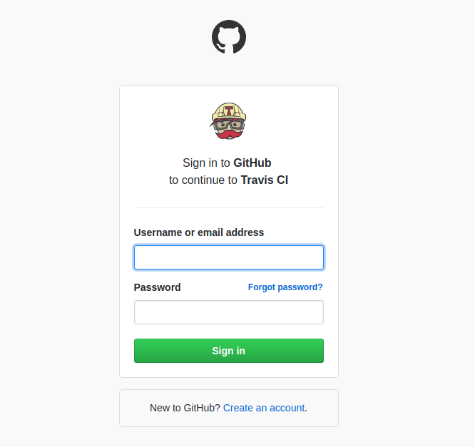
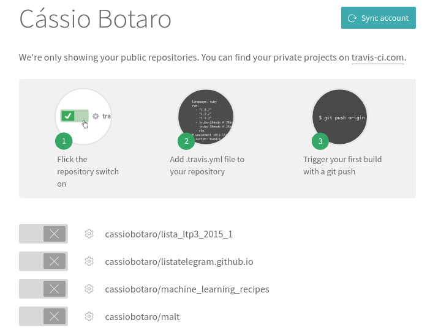

# Integração contínua

O desenvolvedor integra o código alterado e/ou desenvolvido ao projeto principal na mesma frequência com que as funcionalidades são desenvolvidas, sendo feito muitas vezes.

Todo o nosso projeto será contruído utilizando testes automatizados, e sempre rodaremos os testes localmente.

Mas como garantir que minha alteração não impacta com o restante do projeto, ter isto de forma simples e automatizada?
Como garantir que a qualidade do código foi mantida?

Utilizaremos o serviço [travis](https://travis-ci.org/) para checar que nosso código não quebra a "build", ou seja, quando integrado o novo código ao sistema, todo o sistema continua funcional.

## Passo a passo

Utilize sua conta do github para cadastrar no travis.



Seus projetos estarão listados da seguinte maneira



Escolha o projeto todoapp e habilite a integração contínua.


No seu projeto crie um arquivo chamado `.travis.yml` com o seguinte conteúdo.

```yaml
language: python
python:
    - 3.6
install:
  - pip install -U pipenv
  - pipenv install --dev
script:
  - pytest
```

:tada: Pronto, a partir de agora, o travis irá rodar todos os testes do seu projeto de forma automatizada e indicara se a construção do mesmo está com problemas.

Isto será extremamente útil nos póximos passos.

`$ git add .travis.yml`

:floppy_disk: Para terminar a integração com travis, salve a versão atual do projeto e veja a primeira contrução sendo realizada.

`git commit -m "integração contínua"`

:octocat: Por fim envie ao github a versão atualizada do projeto.

`git push`


## Referências

- [Integração contínua: uma introdução ao assunto](http://www.devmedia.com.br/integracao-continua-uma-introducao-ao-assunto/28002)


[Ir para o passo 5 :arrow_right:](passo05.md)

[:leftwards_arrow_with_hook: Voltar ao README ](README.md)
