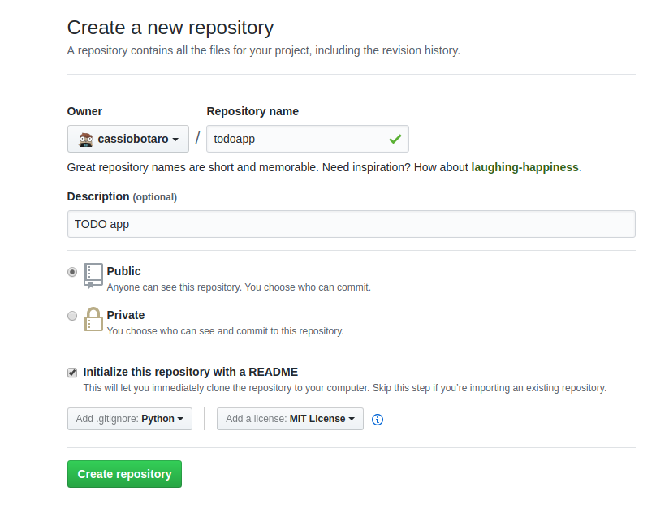

# Inicializando um projeto

Antes de inicializar o projeto vamos certificar que todos os pré-requisitos estão instalados na máquina.

## Pré-requisitos

### Python

Digite em um terminal o seguinte comando `python3 --version` e verique se a saída é similar a apresentada abaixo.
É importante que a versão do python seja 3.4+.

```bash
$ python3 --version
Python 3.6.2
```

Versões mais atuais do ubuntu já vem com o python 3 instalado, e inclusive, a partir da versão 17.10, essa passa a ser a versão padrão do sistema.

### Pip

Pip é o gerenciador de pacotes do python. É um cliente de linha de comandos utilizado para controle das depêndencias do projeto.

Digite `pip3 --version` e verifique se a saída está como apresentado abaixo.

```bash
$ pip3 --version
pip 9.0.1 from /usr/lib/python3.6/site-packages (python 3.6)
```
Certifique que o python do comando pip é acima da versão 3.4.

Esta ferramenta não vem por padrão no sistema operacional ubuntu e pode ser instalada utilizando o comando `sudo apt install python3-pip`.

### Pipenv

Ferramenta recente e moderna, ajuda no gerenciamento de ambientes isolados e na construção de projetos.

Uma vantagem da utilização desta ferramenta é que em ambientes virtuais, não precisamos de permissão de superusuário para instalação de ferramentas e não modificamos as bilbiotecas contidas no sistema.

Esta ferramenta também não vem por padrão no sitema e pode ser instalada através do comando `sudo pip install pipenv`.

Para checar sua instalação digite o comando `pipenv --version`.

```bash
$ pipenv --version
pipenv, version 8.2.5
```

### Git

Controle de versão livre e de código aberto, construido para lidar com projetos pequenos e grandes de maneira rápida e eficiente.

Chega de ficar fazendo cópias "agora vai", "final", "final final", etc.

A sua instalação pode ser feita através do comando `sudo apt install git`.

Verifique se sua instalação está ok utilizando o comando `git --version`.

```
$ git --version
git version 2.14.2
```

## Iniciando o projeto

O primeiro passo para desenvolvimento do nosso aplicativo web é cria-lo utilizando um controle de versão. para este minicurso optei pelo controle de versão mais popular hoje em dia que se chama git.

Aproveitando esta escolha, como o Github é grátis e também o mais conhecido, vamos hospedar o projeto lá(vai ajudar com algumas integrações mais tarde.)

Preencha os campos como visto na fotografia abaixo:



Agora faça um "clone" do seu repositório.

```bash
$ git clone https://github.com/cassiobotaro/todoapp.git
Cloning into 'todoapp'...
remote: Counting objects: 5, done.
remote: Compressing objects: 100% (4/4), done.
remote: Total 5 (delta 0), reused 0 (delta 0), pack-reused 0
Unpacking objects: 100% (5/5), done.

```

Aproveite e já configure seu usuário git para este projeto, dentro do diretório recém clonado digite os seguintes comandos.

```bash
$ git config --local user.email <emailutilizado@github.com>

$ git config --local user.name githubusername
```

"Voilá", já temos o projeto iniciado.

## Referências

- [pip quickstart](https://pip.pypa.io/en/stable/quickstart/)
- [python para zumbis](https://www.youtube.com/channel/UCripRddD4BnaMcU833ExuwA)
- [explain git with d3](http://onlywei.github.io/explain-git-with-d3/#)
- [Uma referência visual do git](http://marklodato.github.io/visual-git-guide/index-pt.html)
- [Learn git branching](https://learngitbranching.js.org/)

[Ir para o passo 1 :arrow_right:](passo01.md)

[:leftwards_arrow_with_hook: Voltar ao README ](README.md)
